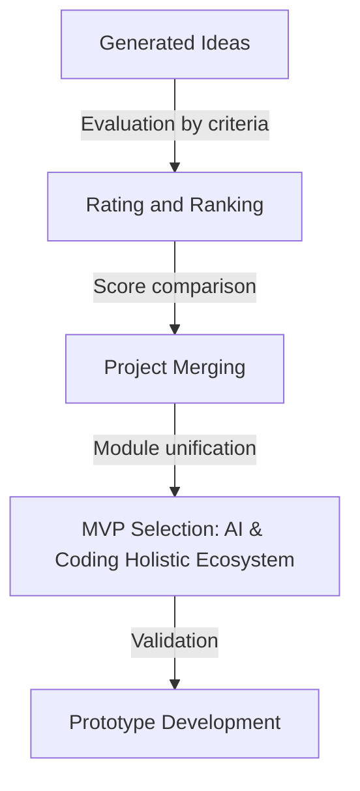
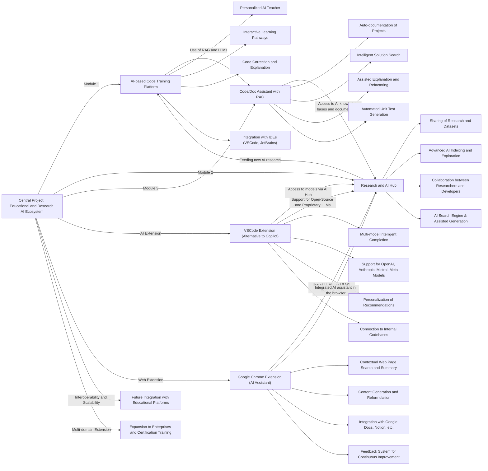

# 📄 **Idea Development Documentation** (fixed)

📅 **Date**: December 22, 2024  
📝 **Author**: Teddy Deberdt

---

## **1. Team Overview**

### **Project Lead**  

🔹 **Sole contributor** overseeing all dimensions of the project, including:  

- **Project Management**: Task orchestration, strategic planning, and continuous progress evaluation.  
- **Technical Development**: Supervision of architectural decisions, model integration, and software implementation.  
- **Research and Innovation**: Conducting systematic literature reviews, evaluating the most advanced methods, and synthesizing results to refine the project scope.  
- **Scientific Documentation**: Structuring, formalizing, and disseminating technical and scientific advancements.  

### **Tools and Workflow**  

- **Knowledge Management**: Using Notion to structure documentation, track workflows, and manage collaborative research.  
- **Iterative Evaluation**: Implementing an agile framework based on regular self-assessments to adjust methodologies and strategies.  
- **Decision Heuristics**: Employing rigorous multi-criteria decision analysis (MCDA) to optimize strategy formulation and tool selection.  

---

## **2. Ideas Explored**

### **1️⃣ AI-Based Code Learning Platform**  

#### **Concept**  

A learning platform leveraging **AI-assisted teaching methods**, combining **real-time tutoring**, **contextual pedagogical guidance**, and **adaptive learning pathways**.  

```mermaid
graph TD;
  A["Central Idea: AI-based Code Training Platform"] 

  A -->|Personalization| B["User Level Analysis"]
  A --> B2["Pathway Recommendations"]
  A --> B3["Continuous Evaluation"]

  A -->|Technologies Used| C["LLMs & Generative AI"]
  A --> C2["Retrieval-Augmented Generation (RAG + Reranking Models + Tika Docs search engine)"]
  A --> C3["Integration with VSCode & IDEs"]

  A -->|Learning Types| D["Guided by an AI Teacher"]
  A --> D2["Interactive Challenges and Exercises"]
  A --> D3["Real-time Assistance"]

  A -->|Target Users| E["Programming Beginners"]
  A --> E2["Intermediate Developers"]
  A --> E3["Computer Science Students"]

  A -->|Future Opportunities| F["Integration with other Educational Platforms"]
  A --> F2["Extension to Multiple Programming Languages"]
  A --> F3["Certification and Skills Validation"]
```

#### **Strengths**  

✅ Designed to adapt to the cognitive development of programming beginners.  
✅ Seamless integration with **major IDEs (VSCode, JetBrains) and LMS platforms**.  
✅ Implements a **Retrieval-Augmented Generation (RAG) learning model** for **contextualized and interactive teaching**.  

#### **Weaknesses**  

❌ High computational cost requiring **advanced model optimization**.  
❌ Development of **sophisticated educational content** to ensure effective learning.  

**Decision**: **Selected as MVP** due to its feasibility and strong educational impact.  

---

### **2️⃣ AI Research & Development Hub**  

#### **Concept**  

A **centralized hub for AI exploration and research**, dedicated to **model experimentation**, dataset management, and **fine-tuning of LLMs**.

```mermaid
graph TD;
  A["Central Idea: Research and Artificial Intelligence Hub"]

  A -->|Collaboration Platform| B["Sharing AI Research"]
  A --> B2["Access to Open-Source Models"]
  A --> B3["Scientific Forum and Discussions"]
  A --> B4["Dataset and Publication Repository"]

  A -->|Technologies Used| C["LLMs & Generative AI"]
  A --> C2["RAG (Retrieval-Augmented Generation) for Exploration"]
  A --> C3["Advanced Vector Search & Indexing"]
  A --> C4["APIs for Access to Pre-trained Models"]

  A -->|Use Cases| D["Research in NLP and Computer Vision"]
  A --> D2["Optimization of AI Algorithms"]
  A --> D3["Benchmarking and Model Comparisons"]
  A --> D4["Creation and Validation of New AI Models"]

  A -->|Target Users| E["AI Researchers"]
  A --> E2["AI Developers and Engineers"]
  A --> E3["Innovative Companies and Startups"]
  A --> E4["Universities and Research Labs"]

  A -->|Future Opportunities| F["Integration with ArXiv and HAL"]
  A --> F2["Development of an Advanced AI Search Engine"]
  A --> F3["Automation of Scientific Reviews"]
  A --> F4["Assisted Generation of Publications and Articles"]
```

#### **Strengths**  

✅ Platform enabling **multi-model experiments and advanced benchmarks**.  
✅ Unified access to **various open-source and proprietary AI models** (Mistral, GPT, Llama, Cohere).  
✅ Integration of an **AI search engine** for **hypothesis extraction and validation**.  

#### **Weaknesses**  

❌ Requires a **robust computational infrastructure**, especially for **large-scale inference**.  
❌ Primarily oriented towards **academic research**, thus less relevant for an education-focused project.  

**Decision**: **Not selected as MVP**, but will be used as **backend to enhance AI functionalities**.  

---

### **3️⃣ AI-Powered Code Assistant & Documentation Tool**  

#### **Concept**  

A **semantic AI assistant** designed for **code generation, contextual explanation, and automation of technical documentation**.

```mermaid
graph TD;
  A["Central Idea: Code and Documentation Assistant with RAG"]

  A -->|Main Features| B["Code generation and completion"]
  A --> B2["Automatic correction and suggestions"]
  A --> B3["Code explanation with context"]
  A --> B4["Auto-documentation of projects"]
  A --> B5["Intelligent search in documentation"]

  A -->|Technologies Used| C["Retrieval-Augmented Generation (RAG)"]
  A --> C2["LLMs specialized in code (CodeLlama, GPT-4-Turbo)"]
  A --> C3["Vector knowledge base"]
  A --> C4["Semantic file analysis"]
  A --> C5["OCR for text extraction from PDF documents"]

  A -->|Use Cases| D["Code learning assistance"]
  A --> D2["Assistance for enterprise developers"]
  A --> D3["Code refactoring and improvement"]
  A --> D4["Generation of technical documentation"]
  A --> D5["Solution search in knowledge bases"]

  A -->|Target Users| E["Students and self-taught programmers"]
  A --> E2["Junior and senior developers"]
  A --> E3["Software development teams"]
  A --> E4["System administrators and DevOps"]

  A -->|Future Opportunities| F["Integration with VSCode and JetBrains"]
  A --> F2["Compatibility with API documentation bases"]
  A --> F3["Automated unit test generation"]
  A --> F4["Continuous improvement through user feedback"]
  A --> F5["Multilingual support for documentation"]
```

#### **Strengths**  

✅ **Optimization of developer workflows** through **semantic code analysis** and real-time documentation retrieval.  
✅ Leverages **RAG and LLMs** to produce **contextualized code explanations**.  
✅ Compatible with **development environments (VSCode, JetBrains) and internal knowledge bases**.  

#### **Weaknesses**  

❌ Requires a **high level of semantic and syntactic reasoning**, complicating implementation.  
❌ More suited for **experienced developers** than beginners.  

**Decision**: **Not selected as MVP**, but key features will be integrated into the learning platform.  

---

### **3. Idea Evaluation and Selection Process**

#### **Evaluation Approach**

To ensure optimal decision-making regarding the selection of the **Minimum Viable Product (MVP)**, a **holistic approach** was adopted. Rather than selecting one of the three initial proposals, an **intelligent aggregation** was chosen to maximize the coverage of needs and the interoperability of the modules. This approach allows for the creation of **a unified environment combining learning, AI research, and development assistance**.

#### **Evaluation Criteria**

Each proposal was analyzed according to a **multi-criteria evaluation** based on four fundamental dimensions:

| **Criterion**           | **Description** |
|-------------------------|-----------------|
| **Feasibility**         | Ability to be implemented with current resources (infrastructure, AI models, software architecture). |
| **Scalability**         | Potential for growth and adaptation to various users and application domains. |
| **Impact**              | Measure of overall utility for different user segments (students, researchers, developers, companies). |
| **Interoperability**    | Ability of the project to integrate with existing tools (IDEs, LMS platforms, AI research databases). |

Proposals were evaluated on a **scale from 1 to 5** for each criterion, leading to a **weighted overall score**.

---

#### **Proposal Evaluation Table**

| **Project Proposal**                       | **Feasibility** | **Scalability** | **Impact** | **Interoperability** | **Total Score** |
|--------------------------------------------|-----------------|-----------------|------------|----------------------|-----------------|
| **1️⃣ AI-Based Code Learning Platform**   | 5/5             | 5/5             | 5/5        | 4/5                  | **19/20 ✅**     |
| **2️⃣ AI Research & Development Hub**      | 4/5             | 5/5             | 4/5        | 5/5                  | **18/20 ✅**     |
| **3️⃣ AI-Powered Code Assistant & Documentation Tool** | 4/5 | 4/5 | 5/5 | 5/5 | **18/20 ✅** |

---

#### **Analysis of Results**

The analysis demonstrated that **each project has unique advantages**, but **no single proposal covers all the identified needs**.

- **The AI-Based Code Learning Platform** has a **strong educational impact** and integrates well with learning platforms, but it requires advanced AI infrastructure.
- **The AI Research & Development Hub** provides a **solid foundation for AI knowledge management** and the development of new models, but its utility is limited to research alone.
- **The AI-Powered Code Assistant**, while powerful in improving developer productivity, **is insufficient as an isolated project**, but it is an **ideal complement** to the other modules.

**💡 Conclusion: Instead of selecting a single project, we decided to unify all three proposals into one integrated environment.**

---

#### **MVP Evaluation and Selection Diagram**

---

### **MVP Selection: Module Unification**

Given the results obtained, the approach chosen is **the integration of all three projects** to form a **holistic AI and coding ecosystem**.

#### **🔹 Why this unification?**

1️⃣ **Better coverage of needs**: The combined environment offers solutions **for education, research, and productivity**.
2️⃣ **Increased interoperability**: By integrating learning, research, and developer assistance, the project **creates a modular, extensible, and unified environment**.
3️⃣ **Adaptability to different audiences**: This solution **covers a broader range of users**, from **programming students to AI researchers and software engineers**.
4️⃣ **Maximizing synergies**: Each module enhances the other:

- **The AI Research Hub** improves the learning platform with more advanced models.
- **The AI Code Assistant** facilitates real-time learning with intelligent corrections and interactive documentation.
- **The AI-Based Learning Platform** provides a structured framework that integrates the functionalities of the other two.

---

## **4. Technologies Used**  

| **Category** | **Technologies** |
|--------------|-----------------|
| **Programming Languages** | Python, JavaScript |
| **AI Models** | OpenAI, Mistral, Llama, Claude, all ai models... |
| **RAG & Indexing** | LlamaIndex, Qdrant |
| **Hybrid Search Pipeline** | Apache Tika, BAAI/bge-reranker-v2-m3, Nomic-Bert |
| **AI Frameworks** | LangChain, Ollama, PyTorch, Sentence-Transformers, ColBERT-AI |
| **NLP Processing** | Tiktoken, NLTK |
| **Databases** | Redis (caching and queue), MariaDB, SQLite, Qdrant (vector DBMS) |
| **AI Acceleration** | NVIDIA CUDA, load balancing cpu/gpu/ram/disks |
| **Data Processing** | Pandas, OCR |
| **Backend Development** | FastAPI, Pydantic |
| **Frontend Development** | React, Next.js |
| **Extensions** | TypeScript (VSCode), Chrome Extensions API |

---

## **5. Unified Environment Concept**

### **Rationale**

To maximize the potential of the project, I have decided to converge the three initial project proposals into a unified environment that encompasses all three concepts. This unified environment will provide a comprehensive platform that integrates the strengths of each proposal, offering a robust solution for AI-assisted education, research, and development.

### **Unified Environment Features**

- **AI-Based Code Learning Platform**: Adaptive learning pathways, real-time contextual assistance, and integration with IDEs and learning tools.
- **AI Research & Development Hub**: Centralized hub for model experimentation, dataset management, and fine-tuning of LLMs.
- **AI-Powered Code Assistant & Documentation Tool**: Semantic AI assistant for code generation, contextual explanation, and automation of technical documentation.

### **Benefits**

- **Comprehensive Solution**: Combines educational, research, and development functionalities into a single platform.
- **Enhanced User Experience**: Provides a seamless experience for users ranging from beginners to advanced developers and researchers.
- **Resource Optimization**: Leverages shared infrastructure and resources to optimize computational costs and development efforts.

---

## **6. Concret usages case and exemples**

### AI-Based Code Learning Platform

- **Programming Beginners**: A computer science student uses the platform to follow a personalized learning path, receiving contextual explanations and real-time corrections.
- **Intermediate Developers**: An intermediate developer uses interactive challenges to enhance their programming skills and receive path recommendations based on their current level.
- **Computer Science Students**: A computer science student uses the platform to supplement their university courses with practical exercises and AI-guided tutorials.

### AI Research & Development Hub

- **AI Researchers**: An AI researcher uses the hub to access open-source models, share their research, and collaborate with other researchers through scientific forums.
- **AI Developers and Engineers**: An AI engineer uses the hub to experiment with new models, optimize algorithms, and compare model performance.
- **Innovative Companies and Startups**: A startup uses the hub to access datasets and pre-trained models, thereby accelerating their AI product development.

### AI-Powered Code Assistant & Documentation Tool

- **Junior and Senior Developers**: A developer uses the assistant to generate code, receive automatic suggestions, and get contextual explanations for complex code segments.
- **Software Development Teams**: A development team uses the tool to automate the technical documentation of their projects, facilitating collaboration and code maintenance.
- **System Administrators and DevOps**: A system administrator uses the assistant to search for solutions in knowledge bases and generate automated unit tests for deployment scripts.

### User Feedback

User feedback will be gathered through multiple methods to continuously improve the project:

- **Surveys and Questionnaires**: Surveys and questionnaires will be sent to users to gather their opinions and suggestions on features and user experience.
- **Usage Analytics**: Analyzing usage data will help understand how users interact with the tools and identify areas for improvement.
- **User Interviews**: Interviews with key users will provide in-depth insights into their needs and expectations.
- **In-App Feedback**: Users will be able to provide feedback directly via the Chrome and VSCode extensions, enabling real-time feedback collection.

### Data Collection and Usage

The collection, cross-referencing, and recording of interactions, inputs, and outputs will be used to enhance LLM models and personalization. The Chrome and VSCode extensions will extend the data collection coverage, thus offering a more comprehensive view of user needs and behaviors.

### User Types and Use Cases

#### User Types

- **Programming Beginners**: Novice users looking to learn the fundamentals and develop their skills.
- **Intermediate Developers**: Developers with some experience looking to deepen their knowledge and improve their skills.
- **AI Researchers**: Researchers specializing in artificial intelligence working on models, algorithms, and advanced applications.
- **AI Developers and Engineers**: Engineers and developers working on AI projects, requiring tools for model experimentation and optimization.
- **Innovative Companies and Startups**: Companies and startups using AI to develop innovative products, needing access to advanced resources and models.
- **Junior and Senior Developers**: Developers of all levels using tools to improve their productivity and code quality.
- **Software Development Teams**: Development teams collaborating on complex projects, requiring tools for documentation and code management.
- **System Administrators and DevOps**: System administrators and DevOps engineers using tools to automate tasks and improve deployment efficiency.

#### Use Cases

- **AI-Based Code Learning Platform**:
  - A student uses the platform to follow a personalized learning path in Python.
  - An intermediate developer uses the interactive challenges to prepare for a certification in JavaScript.
  - A computer science student uses AI-guided tutorials to supplement their university courses.

- **AI Research & Development Hub**:
  - An AI researcher uses the hub to access open-source models and share their research with the community.
  - An AI engineer uses the hub to experiment with new models and optimize natural language processing algorithms.
  - A startup uses the hub to access datasets and pre-trained models for developing an innovative product.

- **AI-Powered Code Assistant & Documentation Tool**:
  - A developer uses the assistant to generate code and receive automatic suggestions while writing scripts.
  - A development team uses the tool to automate technical documentation for their projects, facilitating collaboration.
  - A system administrator uses the assistant to search for solutions in knowledge bases and generate automated unit tests for deployment scripts.

---

### Chrome and VSCode Extensions for Holistic Coverage

To extend the coverage and gain a **holistic view of user needs, behaviors, and expectations**, I have designed **two key extensions** that are integrated with the other modules I am developing:

- **Chrome Extension**: This extension acts as a **web assistant**, offering functionalities such as **RAG (Retrieval-Augmented Generation) assistance**, **translation tools**, and various other user-focused capabilities. By being part of the broader ecosystem, it allows for data collection and feedback gathering directly from the user's interaction with web-based content, contributing valuable insights into their usage patterns.
  
- **VSCode Extension**: This extension provides integrated development tools, ensuring real-time interaction with code, documentation, and project resources. It allows users to access AI-based suggestions, document their work automatically, and receive contextual guidance while coding. The VSCode extension enhances the integration of AI tools in the development process and fosters a seamless workflow.

These extensions are connected with the core modules I am building, allowing for seamless interaction and providing a unified, extended coverage across different user environments. This integration enables a more comprehensive understanding of user engagement, needs, and expectations, ensuring that the tools evolve to meet the diverse demands of the user base.

## **7. Conclusion**  

This documentation outlines the comprehensive approach taken to develop an integrated AI and coding ecosystem. The project leverages the strengths of three initial proposals—AI-Based Code Learning Platform, AI Research & Development Hub, and AI-Powered Code Assistant & Documentation Tool—into a unified environment. This holistic solution aims to address the diverse needs of programming beginners, intermediate developers, AI researchers, and software development teams.

### Key Highlights

- **Unified Environment**: Combines educational, research, and development functionalities into a single platform, enhancing user experience and resource optimization.
- **Adaptive Learning**: Provides personalized learning pathways, real-time contextual assistance, and seamless integration with IDEs and learning tools.
- **Advanced Research Capabilities**: Offers a centralized hub for model experimentation, dataset management, and fine-tuning of LLMs, fostering collaboration among AI researchers and developers.
- **Developer Productivity**: Enhances developer workflows through semantic code analysis, automated documentation, and intelligent code suggestions.
- **User Feedback Integration**: Collects and utilizes user feedback through surveys, usage analytics, interviews, and in-app feedback to continuously improve the tools.
- **Extensions for Holistic Coverage**: Chrome and VSCode extensions extend the data collection and user interaction coverage, providing a comprehensive view of user needs and behaviors.

### Next Steps

- **Integration Planning**: Develop a detailed plan for integrating the features of the three proposals into a unified environment.
- **Prototype Development**: Create prototypes to test the integrated functionalities and gather user feedback.
- **Iterative Improvement**: Continuously refine the unified environment based on user feedback and performance metrics.

This project aims to create a robust, scalable, and user-centric AI and coding ecosystem that supports education, research, and development, ultimately driving innovation and enhancing productivity across various user segments.
